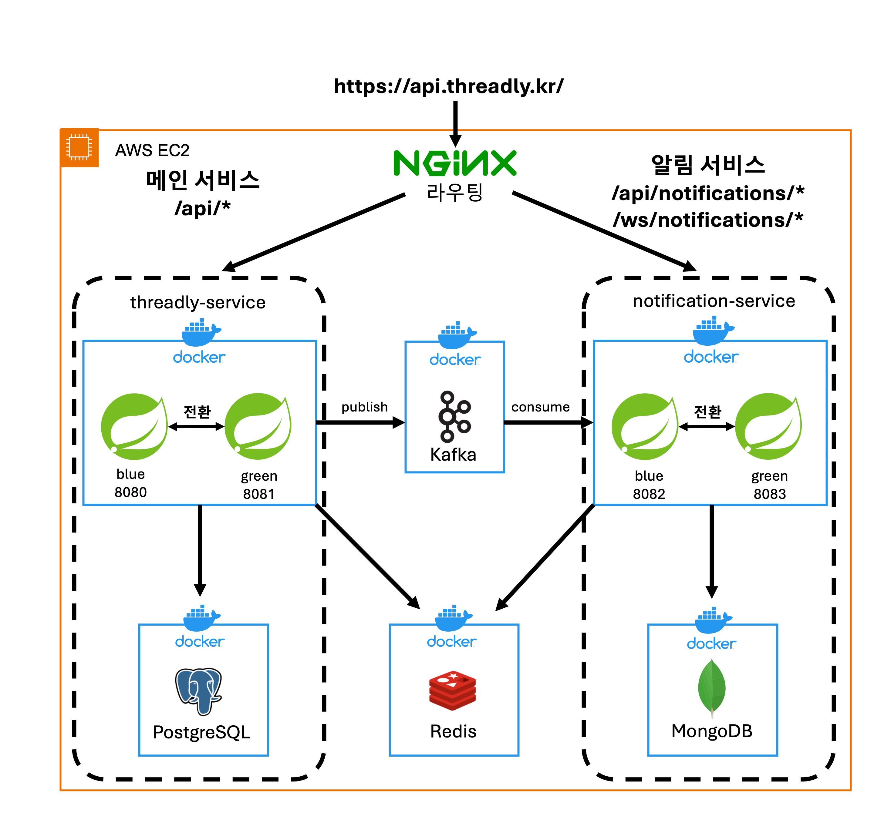

# threadly-service

> Threadly 백엔드의 **메인 서비스**입니다.

### 메인 서비스는 다음 기능을 담당합니다.
- 사용자 회원가입, 로그인, 인증, 프로필 관리 등 사용자 도메인 처리
- 게시글 작성·수정·삭제, 피드 조회 등 게시글 도메인 처리
- 팔로우/팔로잉 관계 관리 등 팔로우 기능 제공
- 알림 발생 시 도메인 이벤트를 발행해 `Kafka`로 알림 서비스에 전달


## 관련 레포 및 서비스

> 전체 아키텍처, 운영 구조, 트러블슈팅 기록은 **Threadly 메인 레포 및 Wiki**에서 확인할 수 있습니다.

- **Threadly 메인 레포**: https://github.com/KimGyuBek/Threadly
- **Wiki 문서**: https://github.com/KimGyuBek/Threadly/wiki
- **알림 서비스**: https://github.com/KimGyuBek/notification-service
- **Swagger**: https://swagger.threadly.kr/threadly/swagger-ui/index.html
 

- **Threadly 서비스**: https://threadly.kr
- **Threadly API**: https://api.threadly.kr


## 백엔드 시스템 구성도




## 모듈 구조

```
threadly-service/
├── threadly-core/              # 비즈니스 로직 계층
│   ├── core-domain/           # 도메인 엔티티 및 비즈니스 규칙
│   ├── core-service/          # 비즈니스 로직 구현 (UseCase)
│   └── core-port/             # 어댑터 인터페이스 정의 (Port)
│
├── threadly-adapters/          # 인프라 계층
│   ├── adapter-persistence/   # 데이터베이스 영속성 (JPA, PostgreSQL)
│   ├── adapter-redis/         # 캐시 및 세션 관리
│   ├── adapter-storage/       # 파일 저장소 처리
│   └── adapter-kafka/         # 메시지 큐 이벤트 처리
│
├── threadly-apps/              # 애플리케이션 계층
│   ├── app-api/               # REST API 서버
│   └── app-batch/             # 배치 작업 처리
│
└── threadly-commons/           # 공통 유틸리티 및 공유 컴포넌트
```


## 사용 기술 스택
### 백엔드
`Java 17` `Spring Boot 3.3.3` `Spring Security` `Spring Data JPA` `Spring Batch` `Spring Cloud Stream`

### DB / 캐시
`PostgreSQL` `Redis` `Flyway`

### 인프라 / 메시징
`Kafka` `Docker` `AWS EC2`  `GitHub Actions` `Prometheus` `Grafana` `Loki` `Promtail`

### 테스트 및 품질
`JUnit 5` `k6` `JaCoCo` `Mockito`

