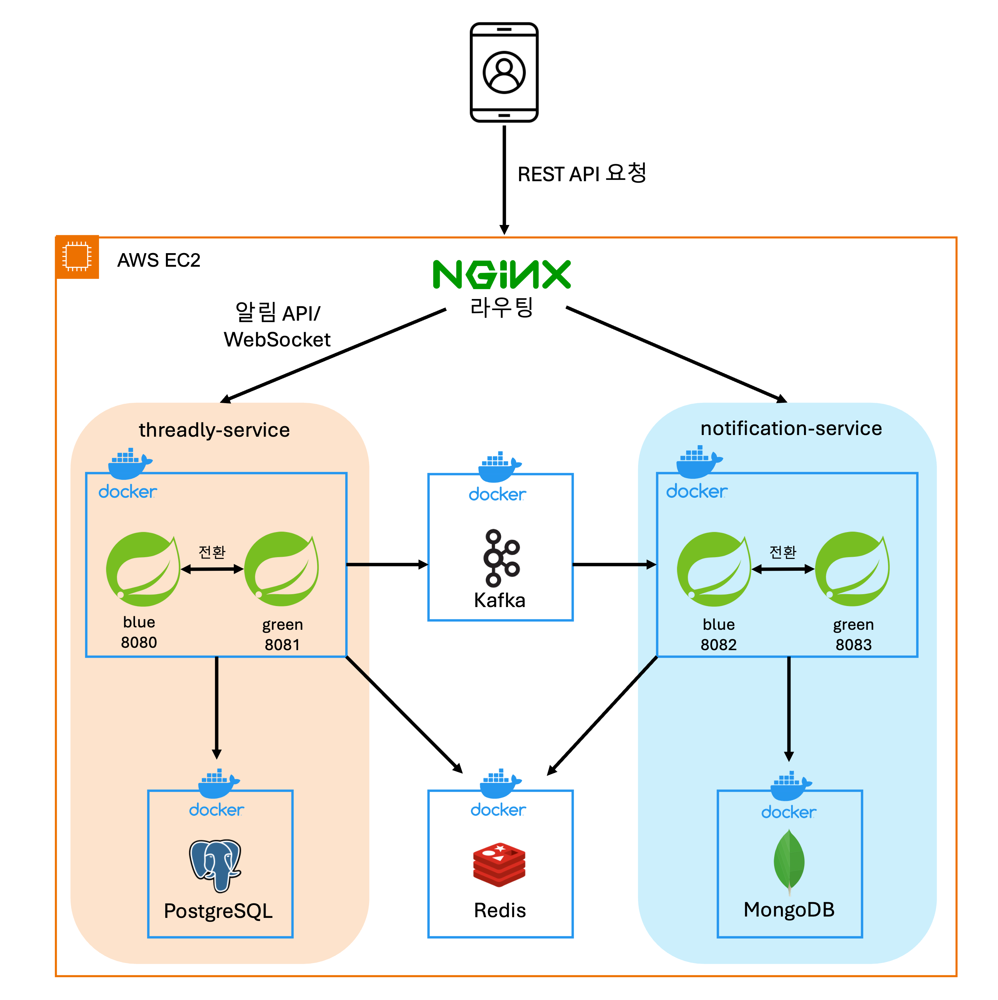

# threadly-service

### Threadly 플랫폼의 메인 **백엔드 서비스**입니다.

플랫폼은 MSA 구조로 구성되어 있으며,

`threadly-service`는 사용자, 게시글, 팔로우, 인증 등 핵심 기능을 담당하는 메인 백엔드 API 서비스입니다.

<br>

> **전체 서비스 아키텍처 및 시스템 구성은 메인 레포에서 확인할 수 있습니다.**

### 메인 레포: https://github.com/KimGyuBek/Threadly
### Wiki 문서: https://github.com/KimGyuBek/Threadly/wiki

### notification-service: https://github.com/KimGyuBek/notification-service

<br>

### Threadly 서비스: https://threadly.kr

---

## 백엔드 시스템 구성도



---

## 모듈 구조

```
threadly-service/
├── threadly-core/              # 비즈니스 로직 계층
│   ├── core-domain/           # 도메인 엔티티 및 비즈니스 규칙
│   ├── core-service/          # 비즈니스 로직 구현 (UseCase)
│   └── core-port/             # 어댑터 인터페이스 정의 (Port)
│
├── threadly-adapters/          # 인프라 계층
│   ├── adapter-persistence/   # 데이터베이스 영속성 (JPA, PostgreSQL)
│   ├── adapter-redis/         # 캐시 및 세션 관리
│   ├── adapter-storage/       # 파일 저장소 처리
│   └── adapter-kafka/         # 메시지 큐 이벤트 처리
│
├── threadly-apps/              # 애플리케이션 계층
│   ├── app-api/               # REST API 서버
│   └── app-batch/             # 배치 작업 처리
│
└── threadly-commons/           # 공통 유틸리티 및 공유 컴포넌트
```

---

## 기술 스택

**Backend Framework**
- Java 17
- Spring Boot 3.3.3
- Spring Cloud 2023.0.3

**Database & Cache**
- PostgreSQL (Flyway 11.5.0)
- Redis
- H2 (테스트)

**Message Queue**
- Kafka (Spring Cloud Stream)

**Security & Auth**
- Spring Security
- OAuth2 Client
- JWT (0.11.5)

**API & Documentation**
- Spring Web
- SpringDoc OpenAPI 2.2.0
- Spring REST Docs

**Utilities**
- Lombok
- MapStruct 1.5.3
- Guava 31.1
- Apache Commons (Lang3, Collections4)
- Jackson 2.17.1

**Testing**
- JUnit 5
- Mockito 5.1.1
- AssertJ 3.25.1
- Fixture Monkey 0.4.12

**Monitoring**
- Spring Actuator
- Micrometer + Prometheus

**Build**
- Gradle (Kotlin DSL)


