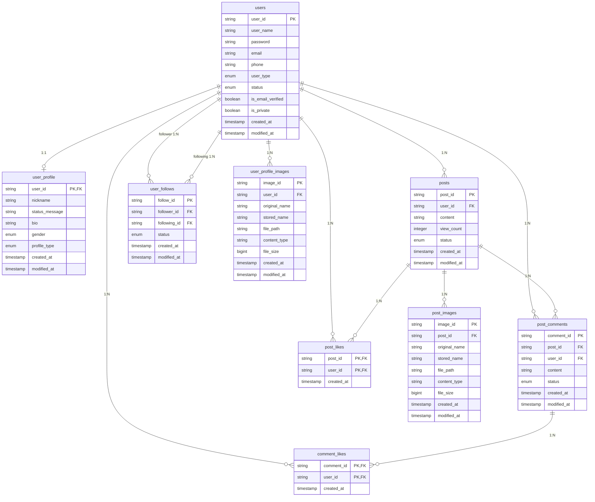

# Threadly Service - 소셜 미디어 플랫폼

## 프로젝트 개요

Threadly Service는 헥사고날 아키텍처 기반의 소셜 미디어 플랫폼입니다. 사용자들이 게시글을 작성하고 공유하며, 댓글과 좋아요를 통해 소통할 수 있는 서비스를 제공합니다.

### 주요 기능
- 사용자 인증 및 권한 관리 (JWT 기반)
- 게시글 CRUD 및 이미지 업로드
- 댓글 시스템
- 좋아요 시스템 (게시글/댓글)
- 알림 시스템 (Kafka 기반 비동기 처리)
- 팔로우/팔로잉 시스템
- 실시간 모니터링 및 로깅

## 기술 스택

### Backend
- **언어**: Java 21 (Production), Java 17 호환
- **프레임워크**: Spring Boot 3.x, Spring Security
- **빌드 도구**: Gradle (Kotlin DSL)
- **의존성 관리**: Spring Dependency Management, Line Recipe Plugin

### 데이터베이스
- **주 데이터베이스**: PostgreSQL 16
- **캐시**: Redis (토큰 관리, 로그인 제한)
- **마이그레이션**: Flyway

### 메시징 및 비동기 처리
- **메시지 브로커**: Apache Kafka 7.4.0 (with Zookeeper)
- **비동기 이벤트**: Spring Events, Transactional Events, Kafka Events

### CI/CD 및 배포
- **CI/CD**: GitHub Actions (3개 워크플로우)
- **컨테이너화**: Docker, Docker Compose
- **배포 전략**: Blue-Green 무중단 배포
- **인프라**: AWS EC2, Docker Hub
- **로드 밸런싱**: Nginx

### 모니터링 및 로깅
- **메트릭 수집**: Prometheus, Pushgateway
- **모니터링 대시보드**: Grafana
- **로그 수집**: Loki, Promtail
- **성능 테스트**: k6 (부하 테스트)
- **로깅**: Structured Logging with Logback

### 파일 저장
- **로컬 개발**: Local File System
- **프로덕션**: AWS S3 (예정)

## 아키텍처

### 헥사고날 아키텍처 (Clean Architecture)

```
┌─────────────────────────────────────────────────────────────┐
│                        Application Layer                     │
│  ┌─────────────────┐  ┌─────────────────┐  ┌─────────────┐  │
│  │   app-api       │  │   app-batch     │  │  Monitoring │  │
│  │  (REST API)     │  │ (Batch Jobs)    │  │   & Logs    │  │
│  └─────────────────┘  └─────────────────┘  └─────────────┘  │
└─────────────────────────────────────────────────────────────┘
                                │
┌─────────────────────────────────────────────────────────────┐
│                         Adapter Layer                       │
│  ┌─────────────────┐  ┌─────────────────┐  ┌─────────────┐  │
│  │adapter-persistence│ │ adapter-redis  │  │adapter-kafka│  │
│  │ (JPA, PostgreSQL) │ │   (Cache)      │  │ (Messaging) │  │
│  └─────────────────┘  └─────────────────┘  └─────────────┘  │
│  ┌─────────────────┐                                        │
│  │ adapter-storage │                                        │
│  │ (File Upload)   │                                        │
│  └─────────────────┘                                        │
└─────────────────────────────────────────────────────────────┘
                                │
┌─────────────────────────────────────────────────────────────┐
│                          Core Layer                         │
│  ┌─────────────────┐  ┌─────────────────┐  ┌─────────────┐  │
│  │   core-domain   │  │  core-service   │  │  core-port  │  │
│  │ (Domain Models) │  │(Business Logic) │  │(Interfaces) │  │
│  └─────────────────┘  └─────────────────┘  └─────────────┘  │
└─────────────────────────────────────────────────────────────┘
                                │
┌─────────────────────────────────────────────────────────────┐
│                        Commons Layer                        │
│  ┌─────────────────┐                                        │
│  │ threadly-commons │                                       │
│  │(Shared Utilities)│                                       │
│  └─────────────────┘                                        │
└─────────────────────────────────────────────────────────────┘
```

### 모듈별 역할

#### 1. threadly-apps (애플리케이션 계층)
- **app-api**: REST API 엔드포인트 제공
  - Spring MVC 컨트롤러
  - 인증/인가 필터
  - API 문서화 (Spring REST Docs)
- **app-batch**: 배치 작업 처리
  - 스케줄링된 작업
  - 데이터 정리 및 집계

#### 2. threadly-core (핵심 비즈니스 로직)
- **core-domain**: 도메인 모델 및 비즈니스 규칙
  - Post, User, Comment, Like 등 엔티티
  - 도메인 이벤트
  - 비즈니스 예외
- **core-service**: 서비스 로직 구현
  - 유스케이스 구현
  - 트랜잭션 관리
  - 이벤트 발행
- **core-port**: 포트 인터페이스 정의
  - 인바운드/아웃바운드 포트
  - 어댑터와의 계약 정의

#### 3. threadly-adapters (어댑터 계층)
- **adapter-persistence**: 데이터베이스 연동
  - JPA Entity
  - Repository 구현
  - QueryDSL을 통한 복잡한 쿼리
- **adapter-redis**: 캐시 및 세션 관리
  - 토큰 관리
  - 로그인 시도 제한
  - 캐시 전략
- **adapter-kafka**: 비동기 메시징
  - 이벤트 프로듀서/컨슈머
  - 알림 처리
  - 메일 발송
- **adapter-storage**: 파일 업로드 처리
  - 로컬 파일시스템
  - S3 (향후)

#### 4. threadly-commons (공통 모듈)
- 유틸리티 클래스
- 공통 예외
- 공통 상수

## 데이터베이스 설계

### ERD (Entity Relationship Diagram)



### 주요 테이블 설명

#### 1. users (사용자 기본 정보)
- 사용자 인증 및 기본 정보 관리
- `user_type`: USER, ADMIN 등
- `status`: ACTIVE, INACTIVE, DELETED, BANNED, INCOMPLETE_PROFILE

#### 2. user_profile (사용자 프로필)
- 사용자의 상세 프로필 정보
- `profile_type`: PUBLIC, PRIVATE 등
- `gender`: MALE, FEMALE, OTHER

#### 3. posts (게시글)
- 게시글 핵심 정보 및 상태 관리
- `status`: ACTIVE, DELETED, BLOCKED, ARCHIVE
- `view_count`: 조회수 카운팅

#### 4. post_comments (댓글)
- 게시글에 대한 댓글 시스템
- `status`: ACTIVE, DELETED

#### 5. post_likes (게시글 좋아요)
- 복합 기본키 사용 (post_id + user_id)
- 중복 좋아요 방지

#### 6. user_follows (팔로우 관계)
- 사용자 간 팔로우/팔로잉 관계
- `status`: ACTIVE, BLOCKED 등

#### 7. 이미지 테이블들
- 게시글 이미지와 프로필 이미지 분리 관리
- 파일 메타데이터 및 경로 정보 저장

## 서비스 플로우

### 1. 사용자 인증 플로우
```
1. 로그인 요청 (email, password)
2. 사용자 정보 검증
3. 로그인 시도 제한 확인 (Redis)
4. Spring Security 인증 처리
5. JWT 토큰 생성 (Access + Refresh)
6. Refresh Token Redis 저장
7. 인증 응답 반환
```

### 2. 게시글 작성 플로우
```
1. 게시글 작성 요청
2. JWT 토큰 검증
3. 게시글 도메인 객체 생성
4. 데이터베이스 저장
5. 이벤트 발행 (PostCreatedEvent)
6. 응답 반환
```

### 3. 좋아요 처리 플로우 (비동기)
```
1. 좋아요 요청
2. 좋아요 처리 (동기)
3. PostLikedEvent 발행
4. Kafka를 통한 알림 이벤트 전송
5. 알림 생성 및 사용자에게 전달
```

### 4. 게시글 삭제 비동기 처리
```
1. 게시글 삭제 요청
2. 게시글 상태를 DELETED로 변경
3. PostDeletedEvent 발행
4. 비동기 연관 데이터 정리:
   - 댓글 삭제
   - 좋아요 삭제
   - 이미지 파일 삭제
   - 알림 삭제
```

## Docker 구성

### 환경별 Docker Compose

#### Local 환경
```yaml
services:
  - app: Threadly API 서버
  - postgresql: 주 데이터베이스
  - redis: 캐시 및 세션
  - kafka: 메시지 브로커
  - zookeeper: Kafka 코디네이터
  - prometheus: 메트릭 수집
  - grafana: 모니터링 대시보드
  - loki: 로그 수집
```

#### Production 환경
- **Blue-Green 배포**: 무중단 배포 지원
- **Resource Limits**: 메모리 600MB, CPU 0.8
- **Health Check**: 애플리케이션 상태 모니터링
- **Auto Restart**: 장애 시 자동 재시작

### 네트워크 구성
```
Networks:
├── service-network: 주요 서비스 간 통신
├── kafka-network: Kafka 클러스터 통신
└── monitoring-network: 모니터링 도구 통신
```

## 비동기 이벤트 처리

### 이벤트 처리 전략

#### 1. Spring Events (동일 트랜잭션)
- 도메인 이벤트 처리
- 트랜잭션 내 일관성 보장

#### 2. Transactional Events (트랜잭션 완료 후)
- 트랜잭션 커밋 후 이벤트 처리
- 외부 시스템 연동

#### 3. Kafka Events (완전 비동기)
- 마이크로서비스 간 통신
- 높은 처리량 요구사항
- 장애 복구 및 재시도

### 성능 비교
```
동기 처리: ~100ms
Spring Events: ~120ms (+20%)
Transactional Events: ~130ms (+30%)
Kafka Events: ~150ms (+50%)
```

## Grafana 실시간 모니터링

### 통합 모니터링 대시보드

#### 1. 애플리케이션 성능 대시보드
```
┌─────────────────────────────────────────────────────┐
│ HTTP Request Metrics                                 │
├─────────────────────────────────────────────────────┤
│ • 응답 시간: P50/P95/P99 추세 그래프                │
│ • RPS (초당 요청 수): 실시간 처리량                 │
│ • 에러율: HTTP 4xx/5xx 비율                         │
│ • 엔드포인트별 성능: 상위 느린 API 목록             │
└─────────────────────────────────────────────────────┘

┌─────────────────────────────────────────────────────┐
│ Business Logic Metrics                               │
├─────────────────────────────────────────────────────┤
│ • 게시글 생성률: 시간별 게시글 작성 수              │
│ • 좋아요 처리율: 동기 vs 비동기 성능 비교           │
│ • 알림 발송률: Kafka 이벤트 처리 상태               │
│ • 사용자 활동: 로그인/회원가입 추세                 │
└─────────────────────────────────────────────────────┘
```

#### 2. 인프라 모니터링 대시보드
```
┌─────────────────────────────────────────────────────┐
│ System Resources                                     │
├─────────────────────────────────────────────────────┤
│ • CPU 사용률: Blue/Green 환경별 비교                │
│ • 메모리 사용률: JVM Heap 상태                      │
│ • 디스크 I/O: 읽기/쓰기 성능                        │
│ • 네트워크: 트래픽 모니터링                         │
└─────────────────────────────────────────────────────┘

┌─────────────────────────────────────────────────────┐
│ Database & Cache Performance                         │
├─────────────────────────────────────────────────────┤
│ • PostgreSQL: 커넥션 풀, 쿼리 응답 시간             │
│ • Redis: 히트율, 메모리 사용량                      │
│ • 슬로우 쿼리: 성능 이슈 쿼리 추적                  │
└─────────────────────────────────────────────────────┘
```

#### 3. Kafka 메시징 대시보드
```
┌─────────────────────────────────────────────────────┐
│ Kafka Cluster Health                                 │
├─────────────────────────────────────────────────────┤
│ • 메시지 처리량: Producer/Consumer 성능              │
│ • 컨슈머 랙: 실시간 지연 상태                       │
│ • 파티션 상태: 분산 처리 균형                       │
│ • 에러율: 실패한 메시지 비율                        │
└─────────────────────────────────────────────────────┘
```

#### 4. 배포 및 장애 대응 대시보드
```
┌─────────────────────────────────────────────────────┐
│ Blue-Green Deployment Status                         │
├─────────────────────────────────────────────────────┤
│ • 현재 활성 환경: Blue(8080) / Green(8081)          │
│ • Health Check 상태: 실시간 서비스 헬스             │
│ • 배포 이력: 성공/실패 기록                         │
│ • 롤백 준비: 즉시 이전 버전 복구 가능               │
└─────────────────────────────────────────────────────┘
```

### 알림 및 경고 시스템

#### 임계값 기반 알림
- **응답 시간**: P99 > 2초 지속 시 알림
- **에러율**: 5% 초과 시 즉시 알림
- **시스템 리소스**: CPU 80% 초과 시 경고
- **데이터베이스**: 커넥션 풀 90% 사용 시 알림

#### k6 성능 테스트 통합
- **자동 성능 테스트**: 배포 후 자동 실행
- **성능 회귀 감지**: 이전 버전 대비 성능 저하 감지
- **부하 테스트 스케줄링**: 정기적 성능 검증

### 로깅 전략
- **Structured Logging**: JSON 형태 로그
- **Log Levels**: ERROR, WARN, INFO, DEBUG
- **Log Aggregation**: Loki를 통한 중앙 집중화
- **실시간 로그 분석**: Grafana에서 로그 패턴 분석

## 개발 환경 설정

### 사전 요구사항
- Java 17
- Docker & Docker Compose
- Gradle

### 로컬 실행
```bash
# 1. 인프라 서비스 시작
cd infra/compose/local
docker-compose -f db/docker-compose.yml up -d
docker-compose -f kafka/docker-compose.yml up -d

# 2. 애플리케이션 빌드 및 실행
./gradlew clean build
./gradlew :threadly-apps:app-api:bootRun

# 3. 배치 서비스 실행
./gradlew :threadly-apps:app-batch:bootRun
```

### 테스트 실행
```bash
# 단위 테스트
./gradlew test

# 통합 테스트
./gradlew integrationTest

# 전체 테스트
./gradlew check
```

## API 엔드포인트

### 인증
- `POST /api/auth/login` - 로그인
- `POST /api/auth/logout` - 로그아웃
- `POST /api/auth/reissue` - 토큰 재발급

### 게시글
- `GET /api/posts` - 게시글 목록
- `POST /api/posts` - 게시글 작성
- `GET /api/posts/{postId}` - 게시글 상세
- `PUT /api/posts/{postId}` - 게시글 수정
- `DELETE /api/posts/{postId}` - 게시글 삭제

### 댓글
- `GET /api/posts/{postId}/comments` - 댓글 목록
- `POST /api/posts/{postId}/comments` - 댓글 작성
- `PUT /api/comments/{commentId}` - 댓글 수정
- `DELETE /api/comments/{commentId}` - 댓글 삭제

### 좋아요
- `POST /api/posts/{postId}/likes` - 게시글 좋아요
- `DELETE /api/posts/{postId}/likes` - 게시글 좋아요 취소
- `POST /api/comments/{commentId}/likes` - 댓글 좋아요
- `DELETE /api/comments/{commentId}/likes` - 댓글 좋아요 취소

## CI/CD 및 배포 전략

### GitHub Actions 워크플로우

#### 1. CI 워크플로우 (ci.yml)
```yaml
트리거: Pull Request → develop/master 브랜치
프로세스:
1. Java 21 환경 설정
2. Gradle 캐싱 및 빌드
3. Docker Compose로 테스트 환경 구성
4. 테스트 실행 및 리포트 수집
5. 테스트 환경 정리
```

#### 2. CD 워크플로우 (cd.yml) - 메인 애플리케이션
```yaml
트리거: master 브랜치 푸시
프로세스:
1. Gradle 빌드 및 Docker 이미지 생성
2. Docker Hub에 이미지 푸시
3. AWS EC2에 배포 파일 전송
4. Blue-Green 배포 스크립트 실행
5. 무중단 배포 완료
```

#### 3. Batch CD 워크플로우 (batch-cd.yml)
```yaml
트리거: 배치 관련 파일 변경 또는 수동 실행
프로세스:
1. 배치 애플리케이션 빌드
2. 배치 전용 Docker 이미지 생성
3. 별도 EC2 인스턴스에 배포
4. systemd 서비스로 스케줄링
```

### Blue-Green 무중단 배포

#### 배포 프로세스


#### 핵심 특징
- **무중단 서비스**: 트래픽 전환 중 서비스 중단 없음
- **즉시 롤백**: Health Check 실패 시 자동 롤백
- **포트 기반 전환**: Blue(8080) ↔ Green(8081)
- **Nginx 로드밸런싱**: 트래픽 라우팅 관리

#### 배포 스크립트 주요 로직
```bash
# 현재 활성 환경 확인
parse_current_port() {
  grep proxy_pass /etc/nginx/sites-available/default
}

# Health Check (최대 10회, 10초 간격)
health_check() {
  curl -fsS "http://localhost:${port}/actuator/health"
}

# 트래픽 전환
nginx_port_change() {
  sed -i "s/$current_port/$next_port/" /etc/nginx/sites-available/default
  nginx -s reload
}
```

### 성능 테스트 (k6)

#### 테스트 시나리오
1. **동기 처리 테스트**: Kafka 없이 동기식 처리 성능 측정
2. **비동기 처리 테스트**: Kafka 장애 상황에서 비동기 처리 안정성 검증
3. **P99 성능 측정**: 고부하 상황에서 응답 시간 분석

#### 핵심 메트릭
- **응답 시간**: P95, P99 측정
- **에러율**: HTTP 에러 및 비즈니스 로직 실패율
- **처리량**: RPS (Requests Per Second)
- **안정성**: Kafka 장애 시 서비스 가용성

### 모니터링 시스템

#### Grafana 대시보드 구성


#### 주요 모니터링 지표
1. **애플리케이션 메트릭**
   - HTTP 요청 응답 시간 (P50, P95, P99)
   - 에러율 및 성공률
   - JVM 메모리 사용률
   - 스레드 풀 상태

2. **비즈니스 메트릭**
   - 게시글 생성/조회 수
   - 좋아요/댓글 처리 수
   - 사용자 활동 지표

3. **인프라 메트릭**
   - CPU/메모리 사용률
   - 디스크 I/O
   - 네트워크 트래픽
   - 데이터베이스 커넥션 풀

4. **Kafka 메트릭**
   - 메시지 처리량
   - 컨슈머 랙(Lag)
   - 파티션별 처리 상태

## 보안 고려사항

### 인증 보안
- JWT 토큰 만료 시간 관리
- Refresh Token 로테이션
- 로그인 시도 제한 (5회)
- 비밀번호 해시화 (BCrypt)

### API 보안
- CORS 설정
- Rate Limiting
- Input Validation
- SQL Injection 방지

### 인프라 보안
- 컨테이너 보안 스캔
- 네트워크 격리
- 시크릿 관리

## 성능 최적화

### 데이터베이스 최적화
- 인덱스 전략
- 쿼리 최적화
- 커넥션 풀 튜닝

### 캐시 전략
- Redis 캐시 활용
- 애플리케이션 레벨 캐시
- CDN 활용 (정적 파일)

### 비동기 처리
- 이벤트 기반 아키텍처
- 백그라운드 작업 분리
- 배치 처리 최적화

## 장애 대응

### 모니터링 알림
- 애플리케이션 에러 알림
- 인프라 이상 알림
- 성능 임계치 알림

### 복구 절차
1. 장애 감지 및 알림
2. 로그 분석 및 원인 파악
3. 핫픽스 또는 롤백
4. 사후 분석 및 개선

## 향후 계획

### 기능 확장
- 실시간 채팅
- 동영상 업로드
- 검색 기능 강화
- 추천 알고리즘

### 기술적 개선
- 마이크로서비스 분리
- Kubernetes 도입
- 서비스 메시 적용
- 이벤트 소싱 도입

### 성능 개선
- 읽기 전용 복제본
- 샤딩 전략
- 캐시 계층 확장
- CDN 도입

## 기여 가이드

### 개발 프로세스
1. Feature 브랜치 생성
2. 코드 작성 및 테스트
3. Pull Request 생성
4. 코드 리뷰
5. 머지 및 배포

### 코딩 컨벤션
- Java Code Style 준수
- 테스트 커버리지 80% 이상
- API 문서화 필수
- 커밋 메시지 규칙 준수

### 이슈 관리
- GitHub Issues 활용
- 라벨링 시스템
- 우선순위 관리
- 진행 상황 추적

---

본 프로젝트는 현대적인 백엔드 개발 모범 사례를 적용한 소셜 미디어 플랫폼으로, 확장 가능하고 유지보수가 용이한 아키텍처를 지향합니다.